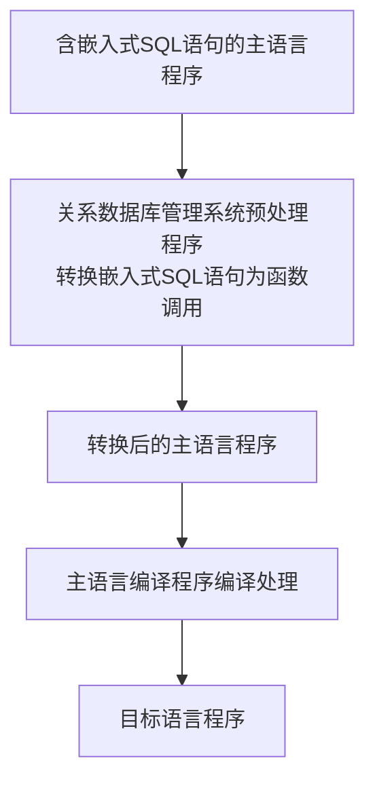

# 第1章 绪论

## 1.1数据库系统概述

## 1.2 数据模型


关系术语   |    一般表格的术语  
:--------: | :---------------:
关系名     |    表名
关系模式   |    表头（表格的描述）
关系       |    （一张）二维表  
元组       |    记录或行
属性       |    列
属性名     |    列名
属性值     |    列值
分量       |    一条记录中的一个列值
非规范关系  |   表中有表（大表中嵌有小表）

- 关系的完整性约束条件包括三大类：实体完整性、参照完整性和用户定义的完整性

## 1.3 数据库系统的结构
### 1.3.1 数据库系统模式
- 在数据模式中有“型” (type) 和“值” (value) 的概念
- 模式(schema)是数据库中全体数据的逻辑结构和特征的描述，仅仅设计型的描述
- 模式是相对稳定的，而实例是相对变动的

### 1.3.1 数据库系统的三级模式

#### 1.模式(schema)
- 模式也称**逻辑**模式，是数据库中全体数据的逻辑结构和特征的描述，是所有用户的公共数据视图
- 模式实际上是数据库数据在逻辑级上的**视图**。
- DBMS中提供模式定义语言（模式DDL）来严格地定义模式

- 模式对应计算机系统软件中对数据库管理时所能看到的数据描述。


#### 2.外模式(external schema)
- 外模式也称子模式(subschema) 或用户模式，它是数据库**用户**（包括应用程序员和最终用户）**能够看见**和使用的局部数据的逻辑结构和特征的描述，**是数据库用户的数据视图**，是与某一应用有关的数据的逻辑表示。
- 用户只能看自己想看的数据，保证了数据库的安全性
- 子模式对应计算机应用软件中对数据库的操作时能查看和使用到的部分的描述。

#### 2.内模式(internal schema)
- 内模式也称存储模式(storage schema), 一个数据库只有一个内模式。它是数据物理结构和存储方式的描述，是数据在数据库内部的组织方式。
- 内模式对应计算机硬件中对数据存储的描述。

### 1.3.3 数据库的二级映像功能与数据独立性

# 第3章 关系数据库标准语言SQL
- SQL(Structured Query Language) 结构化查询语言

## 3.1 SQL概述

### 3.1.2 SQL的特点
- SQL的特点：
    - 数据查询(data query)
    - 数据操纵(data manipulation)
    - 数据定义(data definition)
    - 数据控制(data control)

#### 1.综合统一
- 非关系模型（层次模型、网状模型）的数据语言一般分为：
    - （1）模式数据定义语言(Schema Data Definition Language, 模式DDL)
    - （2）外模式数据定义语言(Subschema Data Definition Language, 外模式DDL或子模式DDL)
    - （3）数据存储有关的描述语言(Data Storage Description Language, DSDL)
    - （4）数据操作语言(Data Manipulation Language, DML)

#### 2.高度非过程化
- 只要提出“做什么”，而无需指明“怎么做”，因此无需了解存储路径。存取路径的选择以及SQL的操作过程由系统自动完成（“面向过程”语言，只需提出“做什么”）

#### 3.面向集合的操作方式
- SQL采用集合操作方式，以元组的集合为操作对象

#### 4.同一种语法结构提供多种使用方式
- SQL能嵌入到高级语言中

#### 5.语言简洁，易学易用
- SQL功能极强，由于设计巧妙，语言十分简洁，完成核心功能只用了9个动词。SQL接近口语，因此易于学习和使用

SQL功能   |   动词
-----     |   -----
数据查询  |   SELECT
数据定义  |   CREATE, DROP, ALTER
数据操纵  |   INSERT, UPDATE, 
数据控制  |   GRANT, REVOKE

### 3.1.3 SQL的基本概念


## 3.3 数据定义
```sql
create database ST;
drop database ST;
create schema ST;
drop schema ST;


/* 建立“学生”表 Student*/
CREATE TABLE Student
(Sno char(9) primary key,
Sname char(20) UNIQUE,
Ssex CHAR(20),
Sage SMALLINT, 
Sdept char(20)
);
drop table student;


/*建立“课程”表Course*/
CREATE TABLE Course
(Cno CHAR(4) PRIMARY KEY,
Cname CHAR(16),
Cpno CHAR(4),
Ccredit SMALLINT,
FOREIGN KEY(Cpno) REFERENCES Course(Cno)
);
drop table course;


CREATE TABLE SC
(Sno CHAR(9),
Cno CHAR(4),
Grade SMALLINT,
PRIMARY KEY (Sno,Cno),
FOREIGN KEY(Sno) REFERENCES Student(Sno),
FOREIGN KEY(Cno)REFERENCES Course(Cno)
);
drop table sc;


/*alter table student add homme char(10);*/
/*alter table student drop column homme;*/
```

## 3.4 数据查询

## 3.5 数据更新

## 3.6 空值的处理

## 3.7 视图

# 第8章 数据库编程

- SQL的两种使用方式
  - 交互式
  - 嵌入式

- 几个问题
  - 1.高级语言变量的值如何传递给SQL语句？
  - 2.如何在高级语言接受SQL穿回来的结果？

- 怎么用其实简单，把背后的道理搞懂才有意义。

## 8.1 嵌入式SQL

### 8.1.1 嵌入式SQL处理过程
- 对嵌入式SQL，数据库管理系统一般采用预编译方法处理，即由数据库管理系统的预处理程序对源程序进行扫描，识别嵌入式SQL，把它们转换成主语言调用语句，以使主语言编译能识别它们，然后由主语言的编译程序将纯的主语言程序编译成目标码。



- 在嵌入式SQL中，为了区分SQL语句和主语言语句，SQL必须加前缀
    - C语言：EXEX SQL <SQL语句>;
    - Java中，称嵌入式SQL为 SQLJ ：#SQL {<SQL语句>};

### 8.1.2嵌入式SQL语句与主语言之间的通信

- 将SQL嵌入到高级语言中混合编程，SQL语句负责操纵数据库，高级语言语句负责控制逻辑流程。这时程序会有两种不同计算模型的语句，它们之间如何通信
- 数据库工作单元与源程序工作单元之间的通信主要包括：

    - （1）向主语言传递SQL语句的执行状态信息，使主语言能够据此信息控制程序流程，主要有SQL通信区(SQL Communication Area, SQLCA) 实现。
    - （2）主语言向SQL语句提供参数，主要用主变量（host variable）实现
    - （3）将SQL语句查询数据库的结果交主语言处理，主要用主变量和游标（cursor）实现

#### 1.SQL通信区

#### 2.主变量

- [ ] 一个主变量可以附带一个任选的指示变量（indicator variable）。**指示变量**是一个整形变量，用来“指示”所指主变量的值或条件。

#### 3.游标

- **游标**是系统为用户开设的一个数据缓冲区，存放SQL语句的执行结果，每个游标区都有一个名字。用户可以通过游标逐一获取记录并赋值给主变量，交由主语言进一步处理。

#### 4.建立和关闭数据库连接

- 连接：嵌入式SQL程序要访问数据库必须先连接数据库，关系数据库管理系统(DBMS) 根据用户信息对连接请求进行合法性验证，只有通过了身份验证，才能建立一个可用的合法连接。
- 关闭：当某个连接上的所有数据库操作完成后，应用程序应主动释放所占用的连接资源

### 8.1.3不使用游标的SQL语句

## 8.2 过程化SQL

## 8.3存储过程和函数

## 8.4 ODBC编程
