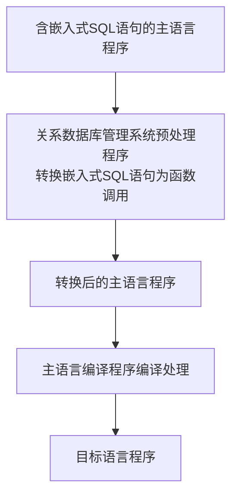

# Datebase-learn

# 第8章 数据库编程

- SQL的两种使用方式
  - 交互式
  - 嵌入式

- 几个问题
  - 1.高级语言变量的值如何传递给SQL语句？
  - 2.如何在高级语言接受SQL穿回来的结果？
  - 3.

- 怎么用其实简单，把背后的道理搞懂才有意义。

## 8.1 嵌入式SQL

### 8.1.1 嵌入式SQL处理过程
- 对嵌入式SQL，数据库管理系统一般采用预编译方法处理，即由数据库管理系统的预处理程序对源程序进行扫描，识别嵌入式SQL，把它们转换成主语言调用语句，以使主语言编译能识别它们，然后由主语言的编译程序将纯的主语言程序编译成目标码。

- 在嵌入式SQL中，为了区分SQL语句和主语言语句，SQL必须加前缀
    - C语言：EXEX SQL <SQL语句>;
    - Java中，称嵌入式SQL为 SQLJ ：#SQL {<SQL语句>};

### 8.1.2嵌入式SQL语句与主语言之间的通信

- 将SQL嵌入到高级语言中混合编程，SQL语句负责操纵数据库，高级语言语句负责控制逻辑流程。这时程序会有两种不同计算模型的语句，它们之间如何通信
- 数据库工作单元与源程序工作单元之间的通信主要包括：

    - （1）向主语言传递SQL语句的执行状态信息，使主语言能够据此信息控制程序流程，主要有SQL通信区(SQL Communication Area, SQLCA) 实现。
    - （2）主语言向SQL语句提供参数，主要用主变量（host variable）实现
    - （3）将SQL语句查询数据库的结果交主语言处理，主要用主变量和游标（cursor）实现

#### 1.SQL通信区

#### 2.主变量

- [ ] 一个主变量可以附带一个任选的指示变量（indicator variable）。**指示变量**是一个整形变量，用来“指示”所指主变量的值或条件。

#### 3.游标

- **游标**是系统为用户开设的一个数据缓冲区，存放SQL语句的执行结果，每个游标区都有一个名字。用户可以通过游标逐一获取记录并赋值给主变量，交由主语言进一步处理。

#### 4.建立和关闭数据库连接

- 连接：嵌入式SQL程序要访问数据库必须先连接数据库，关系数据库管理系统(DBMS) 根据用户信息对连接请求进行合法性验证，只有通过了身份验证，才能建立一个可用的合法连接。
- 关闭：当某个连接上的所有数据库操作完成后，应用程序应主动释放所占用的连接资源

### 8.1.3不使用游标的SQL语句

## 8.2 过程化SQL

## 8.3存储过程和函数

## 8.4 ODBC编程
