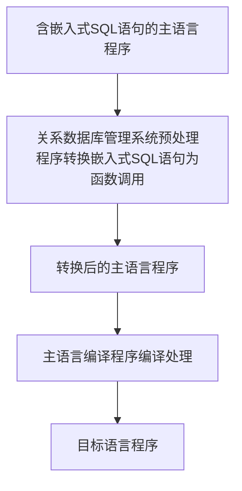

# Datebase-learn

# 第8章 数据库编程

- SQL的两种使用方式
  - 交互式
  - 嵌入式

- 几个问题
  - 1.高级语言变量的值如何传递给SQL语句？
  - 2.如何在高级语言接受SQL穿回来的结果？
  - 3.

- 怎么用其实简单，把背后的道理搞懂才有意义。

## 8.1 嵌入式SQL

### 8.1.1 嵌入式SQL处理过程
- 对嵌入式SQL，数据库管理系统一般采用预编译方法处理，即由数据库管理系统的预处理程序对源程序进行扫描，识别嵌入式SQL，把它们转换成主语言调用语句，以使主语言编译能识别它们，然后由主语言的编译程序将纯的主语言程序编译成目标码。

## 8.2 过程化SQL

## 8.3存储过程和函数

## 8.4 ODBC编程
